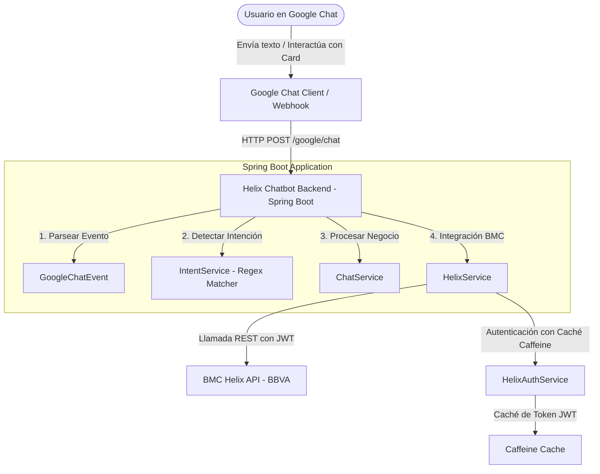

# Helix Chatbot Backend 🤖💼

Este proyecto es la API backend integradora que permite conectar interactivos de **Google Chat** (Google Chat API) con el sistema **BMC Helix** de **BBVA**. Facilita la gestión de incidentes y tickets de soporte técnico directamente a través de salas y mensajes de chat corporativos.

---

## 🏗️ Arquitectura del Sistema

El backend actúa como un **Middleware orquestador** con arquitectura limpia y desacoplada:



---

## ✨ Características Principales

1. **Integración Bidireccional con Google Chat**:
   - Recibe y procesa Webhooks enviados por Google Chat API en el endpoint `/google/chat`.
   - Soporta interacciones dinámicas mediante formularios visuales (**Cards** o Tarjetas) para la creación de incidentes.
   
2. **Motor de Detección de Intenciones (NLU Ligero)**:
   - Implementado en `IntentService` utilizando patrones Regex robustos que identifican intenciones del usuario en lenguaje natural:
     - **Crear Incidentes**: *"crear ticket"*, *"reportar un problema"*, *"registrar caso"*.
     - **Consultar Ticket Específico**: *"estado ticket INC000000004817"*, *"ver ticket INC000000004817"*.
     - **Listar Tickets del Usuario**: *"mis tickets"*, *"mis casos activos"*.
     - **Saludos y Ayuda**: *"hola"*, *"ayuda"*, *"help"*.

3. **Cliente Feign de BMC Helix**:
   - Integración REST nativa y declarativa utilizando `Spring Cloud OpenFeign` (`HelixIncidentClient` y `HelixLoginClient`).
   - Autenticación automática transparente vía Interceptor de Feign (`HelixAuthInterceptor`), que inyecta la cabecera `Authorization: AR-JWT <token>`.
   - **Caché Eficiente**: Uso de Caffeine cache para almacenar el token JWT de BMC Helix, evitando peticiones de login innecesarias y optimizando los tiempos de respuesta.

---

## 🛠️ Tecnologías y Dependencias

- **Java 21**: Explotando características modernas de lenguaje como *Pattern Matching para switch*.
- **Spring Boot 4.0.x** & **Spring Cloud 2025.x**: Ecosistema moderno para servicios de alta disponibilidad.
- **Spring Cloud OpenFeign**: Clientes REST declarativos y limpios.
- **Caffeine Cache**: Proveedor de caché en memoria de alto rendimiento.
- **Lombok**: Reducción de código repetitivo.
- **Maven**: Gestor de construcción y dependencias.

---

## 🔑 Configuración del Entorno

La configuración principal se encuentra en `src/main/resources/application.properties`:

- **Puerto del Servidor**: `8096`
- **BMC Helix Base URL**: `https://bbvaperu-dev-restapi.onbmc.com/api/arsys/v1`
- **Autenticación BMC Helix** (en `HelixAuthService`):
  - Usuario: `ChatAPI`
  - Contraseña: `Bbv4ch4t4pi2026$`

---

## 🚀 Guía de Desarrollo Local

### Prerrequisitos
- **Java JDK 21**
- **Apache Maven 3.9+**

### Construcción del Proyecto
Compila el código y ejecuta las pruebas unitarias:
```bash
mvn clean install
```

### Ejecutar Localmente
Para levantar la aplicación en el puerto `8096`:
```bash
mvn spring-boot:run
```

---

## 🌐 Detalle de Endpoints y Flujos

### 1. Endpoint Principal: Eventos de Google Chat
* **Ruta**: `POST /google/chat`
* **Cuerpo (JSON)**: Payload estándar enviado por los Webhooks de Google Chat.
* **Flujos soportados**:
  - **Mensaje de texto**: Si el usuario envía *"mis tickets"*, el backend consulta a Helix los incidentes asociados al correo del remitente y responde con una lista detallada en formato Markdown de Google Chat.
  - **Acción interactiva**: Si el usuario escribe *"crear ticket"*, el backend responde con una tarjeta interactiva (**Incident Form Card**) que contiene campos de entrada de texto (`registry`, `title`, `description`).
  - **Envío de formulario**: Al pulsar "Aceptar" en la tarjeta, Google Chat envía un evento `CARD_CLICKED` con método `onClickOkButton`. El backend extrae los valores, crea el incidente en BMC Helix, y responde confirmando el número de ticket generado.
